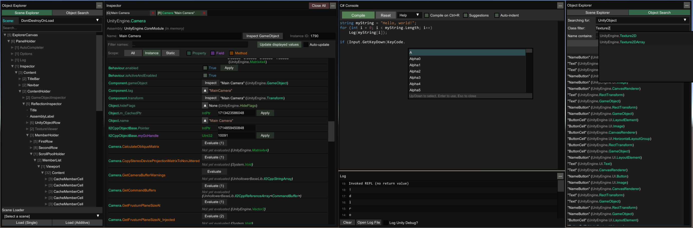

# Silk Searcher

An in-game UI for exploring, debugging, and modifying Spiderheck.

**Features:**

- Supports the Silk Mod Loader.
- Powered by [UniverseLib](https://github.com/SilkModding/UniverseLib).
- This is a fork of [UnityExplorer](https://github.com/SilkModding/UnityExplorer).

## Changes from original

- Bug fixes due to continued development
  - Support for the Silk Mod Loader in Spiderheck
  - Stabilize overall performance by adjusting project settings, etc.

If there are any bugs or features you want, please create a [ticket](https://github.com/SilkModding/SilkSearcher/issues/new/choose)!

## Silk Mod Loader

| Release | Support |
| ------- | ------- |
| 0.4     | ✅      |
| 0.3     | ✅      |
| 0.2     | ✖️      |
| 0.1     | ✖️      |

1. Unzip the release file into a folder
2. Copy the DLL inside the `Mods` folder into your Silk Mod Loader `Mods` folder

## Standalone

| Mono                                                                                                             | Silk                                                                                                             |
| ---------------------------------------------------------------------------------------------------------------- | ---------------------------------------------------------------------------------------------------------------- |
| ✅ [link](https://github.com/SilkModding/SilkSearcher/releases/latest/download/SilkSearcher.Standalone.Mono.zip) | ✅ [link](https://github.com/SilkModding/SilkSearcher/releases/latest/download/SilkSearcher.Standalone.Silk.zip) |

The standalone release can be used with any injector or loader of your choice, but it requires you to load the dependencies manually.

1. Ensure the required libs are loaded - UniverseLib, HarmonyX and MonoMod. Take them from the [`SilkSearcher.Editor`](https://github.com/sinai-dev/SilkSearcher/releases/latest/download/SilkSearcher.Editor.zip) release if you need them.
2. For IL2CPP, load Il2CppAssemblyUnhollower and start an [Il2CppAssemblyUnhollower runtime](https://github.com/knah/Il2CppAssemblyUnhollower#required-external-setup)
3. Load the SilkSearcher DLL
4. Create an instance of Silk Searcher with `SilkSearcher.ExplorerStandalone.CreateInstance();`
5. Optionally subscribe to the `ExplorerStandalone.OnLog` event to handle logging if you wish

## Unity Editor

1. Download the [`SilkSearcher.Editor`](https://github.com/sinai-dev/SilkSearcher/releases/latest/download/SilkSearcher.Editor.zip) release.
2. Install the package, either by using the Package Manager and importing the `package.json` file, or by manually dragging the folder into your `Assets` folder.
3. Drag the `Runtime/SilkSearcher` prefab into your scene, or create a GameObject and add the `Explorer Editor Behaviour` script to it.

# Common issues and solutions

Although SilkSearcher should work out of the box for most Silk Mod Loader games, in some cases you may need to tweak the settings for it to work properly.

To adjust the settings, open the config file:

- Silk Mod Loader: `UserData\SilkPreferences.cfg`
- Standalone: `silk-dev-SilkSearcher\config.cfg`

Try adjusting the following settings and see if it fixes your issues:

- `Startup_Delay_Time` - increase to 5-10 seconds (or more as needed), can fix issues with SilkSearcher being destroyed or corrupted during startup.
- `Disable_EventSystem_Override` - if input is not working properly, try setting this to `true`.

If these fixes do not work, please create an issue in this repo and I'll do my best to look into it.

# Features

<p align="center">
  <a href="https://raw.githubusercontent.com/sinai-dev/SilkSearcher/master/img/preview.png">
    
  </a>
</p>

### Inspector API

If you want to inspect an object or Type from outside the C# console, use the `InspectorManager` class:

**To inspect an object:**

```csharp
SilkSearcher.InspectorManager.Inspect(theObject);
```

**To inspect a Type:**

```cs
SilkSearcher.InspectorManager.Inspect(typeof(SomeClass));
```

### Object Explorer

- Use the <b>Scene Explorer</b> tab to traverse the active scenes, as well as the DontDestroyOnLoad and HideAndDontSave objects.
  - The "HideAndDontSave" scene contains objects with that flag, as well as Assets and Resources which are not in any scene but behave the same way.
  - You can use the Scene Loader to easily load any of the scenes in the build (may not work for Unity 5.X games)
- Use the <b>Object Search</b> tab to search for Unity objects (including GameObjects, Components, etc), C# Singletons or Static Classes.
  - Use the UnityObject search to look for any objects which derive from `UnityEngine.Object`, with optional filters
  - The singleton search will look for any classes with a typical "Instance" field, and check it for a current value. This may cause unexpected behaviour in some IL2CPP games as we cannot distinguish between true properties and field-properties, so some property accessors will be invoked.

### Inspector

The inspector is used to see detailed information on objects of any type and manipulate their values, as well as to inspect C# Classes with static reflection.

- The <b>GameObject Inspector</b> (tab prefix `[G]`) is used to inspect a `GameObject`, and to see and manipulate its Transform and Components.
  - You can edit any of the input fields in the inspector (excluding readonly fields) and press <b>Enter</b> to apply your changes. You can also do this to the GameObject path as a way to change the GameObject's parent. Press the <b>Escape</b> key to cancel your edits.
  - <i>note: When inspecting a GameObject with a Canvas, the transform controls may be overridden by the RectTransform anchors.</i>
- The <b>Reflection Inspectors</b> (tab prefix `[R]` and `[S]`) are used for everything else
  - Automatic updating is not enabled by default, and you must press Apply for any changes you make to take effect.
  - Press the `▼` button to expand certain values such as strings, enums, lists, dictionaries, some structs, etc
  - Use the filters at the top to quickly find the members you are looking for
  - For `Texture2D`, `Image`, `Sprite` and `Material` objects, there is a `View Texture` button at the top of the inspector which lets you view the Texture(s) and save them as a PNG file.
  - For `AudioClip` objects there is a `Show Player` button which opens an audio player widget. For clips which are loaded as `DecompressOnLoad`, there is also a button to save them to a `.wav` file.

### C# Console

- The C# Console uses the `Mono.CSharp.Evaluator` to define temporary classes or run immediate REPL code.
- You can execute a script automatically on startup by naming it `startup.cs` and placing it in the `silk-dev-SilkSearcher\Scripts\` folder (this folder will be created where you placed the DLL file).
- See the "Help" dropdown in the C# console menu for more detailed information.

### Hook Manager

- The Hooks panel allows you to hook methods at the click of a button for debugging purposes.
  - Simply enter any class and hook the methods you want from the menu.
  - You can edit the source code of the generated hook with the "Edit Hook Source" button. Accepted method names are `Prefix` (which can return `bool` or `void`), `Postfix`, `Finalizer` (which can return `Exception` or `void`), and `Transpiler` (which must return `IEnumerable<HarmonyLib.CodeInstruction>`). You can define multiple patches if you wish.

### Mouse-Inspect

- The "Mouse Inspect" dropdown in the "Inspector" panel allows you to inspect objects under the mouse.
  - <b>World</b>: uses Physics.Raycast to look for Colliders
  - <b>UI</b>: uses GraphicRaycasters to find UI objects

### Freecam

- SilkSearcher provides a basic Free Camera which you can control with your keyboard and mouse.
- Unlike all other features of SilkSearcher, you can still use Freecam while SilkSearcher's menu is hidden.
- Supports using the game's main Camera or a separate custom Camera.
- See the Freecam panel for further instructions and details.

### Clipboard

- The "Clipboard" panel allows you to see your current paste value, or clear it (resets it to `null`)
  - Can copy the value from any member in a Reflection Inspector, Enumerable or Dictionary, and from the target of any Inspector tab
  - Can paste values onto any member in a Reflection Inspector
  - Non-parsable arguments in Method/Property Evaluators allow pasting values
  - The C# Console has helper methods `Copy(obj)` and `Paste()` for accessing the Clipboard

### Settings

- You can change the settings via the "Options" tab of the menu, or directly from the config file.
  - Silk Mod Loader: `UserData\SilkPreferences.cfg`
  - Standalone `{DLL_location}\silk-dev-SilkSearcher\config.cfg`

# Building

1. Run the `build.ps1` powershell script to build SilkSearcher. Releases are found in the `Release` folder.

Building individual configurations from your IDE is fine, though note that the initial build process builds into `Release/<version>/...` instead of the subfolders that the powershell script uses. Batch building is not currently supported with the project.

# Acknowledgments

- [ManlyMarco](https://github.com/ManlyMarco) for [Runtime Unity Editor](https://github.com/ManlyMarco/RuntimeUnityEditor) \[[license](THIRDPARTY_LICENSES.md#runtimeunityeditor-license)\], the ScriptEvaluator from RUE's REPL console was used as the base for SilkSearcher's C# console.
- [Geoffrey Horsington](https://github.com/ghorsington) for [mcs-unity](https://github.com/sinai-dev/mcs-unity) \[no license\], used as the `Mono.CSharp` reference for the C# Console.

### Disclaimer

SilkSearcher is in no way associated with Unity Technologies. "Unity", Unity logos, and other Unity trademarks are trademarks or registered trademarks of Unity Technologies or its affiliates in the U.S. and elsewhere.
